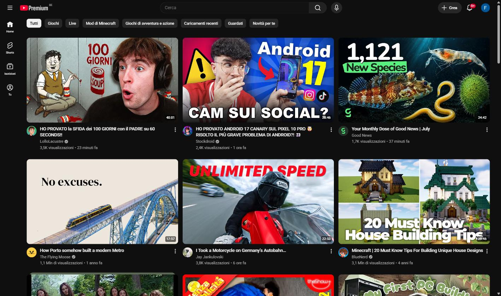
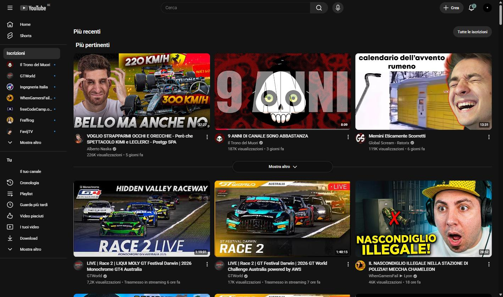
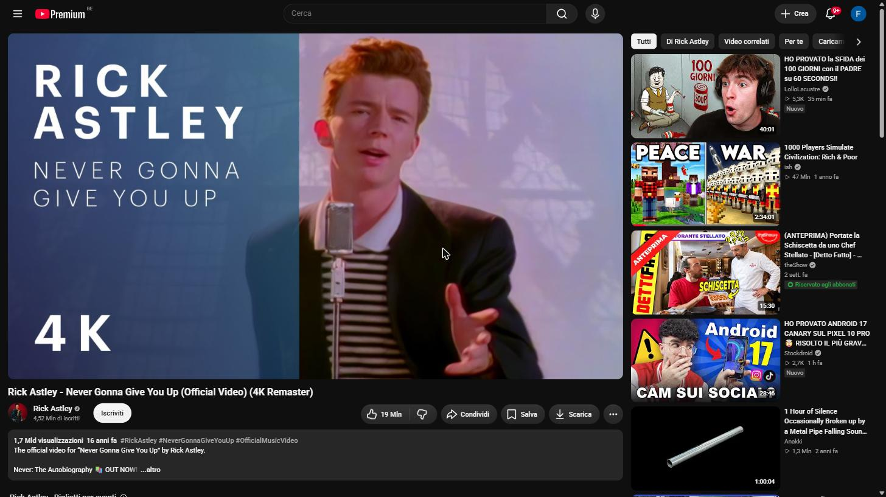
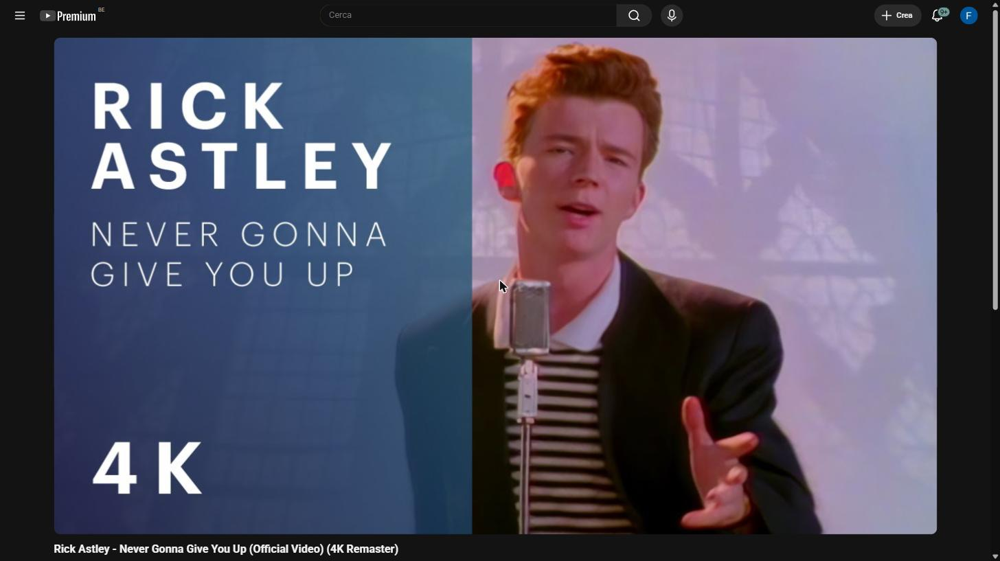

<div align="center">


# No-Tube-Rot

**YouTube, minus whichever parts you say.**

A homepage that isn't an algorithmic feed, Shorts gone from everywhere they appear, a calmer palette, and a video that follows you when you look away — each one a switch, and **every switch starts off**.

[](https://github.com/aerusW/No-Tube-Rot/actions/workflows/checks.yml)


</div>

---

<div align="center">

### The home page → your subscriptions

| Before | After |
| :---: | :---: |
|  |  |

### A watch page → just the video

| Before | After |
| :---: | :---: |
|  |  |

<sub><b>The "after" shots show every switch turned on.</b> A fresh install looks
exactly like the "before" column until you choose otherwise.</sub>

</div>

---

## Contents

[Why](#why) · [What it can do](#what-it-can-do) · [Install](#install) · [Set it up](#set-it-up) · [Privacy](#privacy) · [Under the hood](#under-the-hood) · [Contributing](#contributing) · [License](#license)

---

## Why

You open YouTube to watch one video from a channel you chose. Forty minutes
later you're three Shorts deep into something you'd never have searched for.

That isn't a discipline problem — it's the interface working as designed. The
home grid is an algorithmic feed, Shorts is an infinite swipe surface, and the
red accents exist to pull your eye. No-Tube-Rot can remove any of those levers
and leave everything else alone.

### Why nothing is on by default

Until 2.0 this extension was an opinion you installed. It redirected your
homepage, deleted every Short and repainted the interface the moment it loaded,
and the README called that a feature: *no settings, no popups, load it once and
forget it*.

The trouble with shipping an opinion is that it has to be right about all of
its parts for all of its users, and this one wasn't. Wanting Shorts out of your
search results is not the same as wanting a sage-coloured progress bar. Wanting
a calmer palette is no reason to have the address you typed silently replaced
with a different one. Bundled together, the parts people didn't want were the
reason they uninstalled the parts they did.

So the bundle is gone. Everything it used to do is still here, as 16
independent switches, and **a fresh install changes nothing about YouTube until
you open the menu.** The extension now asks instead of assuming.

## What it can do

Every row is a separate switch, off until you turn it on.

### Redirects

| Switch | What it does |
|---|---|
| **Open on your subscriptions** | `youtube.com` lands on your Subscriptions feed instead of the algorithmic home grid. |
| **Send the Shorts feed away** | The swipe feed at `/shorts` goes to your subscriptions. |
| **Open Shorts as normal videos** | A Short opens in the regular player — scrubber, playback speed, description, no vertical feed. |

### Shorts

| Switch | What it does |
|---|---|
| **Shelves in feeds** | The Shorts rows on home and subscriptions. |
| **Shelf in search results** | The Shorts block wedged into results. |
| **Individual Shorts** | Single Shorts scattered through grids, lists and results. |
| **Sidebar entry** | The Shorts link in the full and collapsed sidebars. |
| **Channel page tab** | The Shorts tab on a channel. |

Matching is locale-independent: YouTube keeps "Shorts" as an untranslated brand
name in every language.

### Appearance

| Switch | What it does |
|---|---|
| **Flat, softer surfaces** | Replaces the near-black and the glaring white with calmer solids. |
| **Replace the red** | Progress bar, scrubber, badges and the logo stop signalling urgency. Choose **sage**, **slate**, **clay** or **plum**. |
| **Quieten the buttons** | Filter chips, pill actions and the search box recede. |
| **Trim the sidebar** | Drops Explore, More from YouTube and the footer links; keeps Home, Subscriptions and You. |
| **Hide the up-next column** | Removes the recommendation rail on watch pages; the video widens to fill it. |

The palette follows YouTube's own light/dark setting, including "Use device
theme". Every accent clears WCAG AA in both themes.

### Picture-in-picture

| Switch | What it does |
|---|---|
| **Pop out when hidden** | A playing video follows you into a floating window when the tab or the browser stops being visible. |
| **Also on losing focus** | Pops out when you click another window, even if YouTube is still on screen. |
| **Put it back on return** | Closes the floating window when you come back — only ever one it opened itself. |

> **Chromium only.** Firefox implements picture-in-picture as a browser control
> rather than something a page can ask for, so these switches do nothing there
> and the menu says so. On Chromium the browser still has the final say: it can
> decline the request, which is why the video is also marked for the browser's
> own hand-off.

## Install

### Chrome · Edge · Brave · any Chromium browser

1. **Download** this repo ([ZIP](https://github.com/aerusW/No-Tube-Rot/archive/refs/heads/main.zip))
   or clone it, into a folder you'll keep — the browser loads it from there.
   ```bash
   git clone https://github.com/aerusW/No-Tube-Rot.git
   ```
2. Open **`chrome://extensions`** (or `edge://extensions`, `brave://extensions`).
3. Turn on **Developer mode** (top-right).
4. Click **Load unpacked** and select the `No-Tube-Rot` folder.
5. Click the toolbar icon and turn on what you want — see
   [Set it up](#set-it-up).

> Prefer a fixed version over the moving `main` branch? Every release ships a
> `.zip` on the [releases page](https://github.com/aerusW/No-Tube-Rot/releases) —
> unzip it and load that folder instead.

> Store listings aren't published yet. Loading unpacked is the supported route
> for now, and it means you can read every line of what you're installing.

### Firefox · Zen

1. Download **`no-tube-rot-<version>.xpi`** from the
   [latest release](https://github.com/aerusW/No-Tube-Rot/releases/latest).
2. Open Firefox and drag the `.xpi` onto the window — or use
   **☰ → Add-ons and themes → ⚙ → Install Add-on From File…**
3. Confirm the install prompt.
4. Open the add-on's **Preferences** and turn on what you want.

The `.xpi` is signed by Mozilla, so it installs permanently and survives
restarts. It's distributed here rather than through addons.mozilla.org, which
has one consequence worth knowing:

> **Firefox installs don't update themselves.** To move to a newer version,
> download the new `.xpi` and install it over the top. Watch the
> [releases page](https://github.com/aerusW/No-Tube-Rot/releases) — YouTube
> changes its markup often, and an out-of-date copy shows up as Shorts quietly
> reappearing.

**From source instead:** open `about:debugging#/runtime/this-firefox` →
**Load Temporary Add-on…** → pick `manifest.json` in the repo folder. This is
the development route; a temporary add-on is gone on the next restart. If you
have also loaded the same folder in Chrome, see the
[note below](#a-note-for-anyone-using-both-browsers).

### A note for anyone using both browsers

Loading the repo folder in Chrome makes it write a `_metadata/` directory
inside. Firefox rejects any extension containing reserved underscore-prefixed
names, so **that folder will no longer load in Firefox** until you delete
`_metadata/`. Use separate folders per browser, or install from the release
artifacts above, which never contain it.

## Set it up

**A fresh install does nothing.** That's deliberate, and it means there is one
step you can't skip.

Open the menu either way — they're the same page:

* **Click the toolbar icon.** Pin it first if your browser hid it behind the
  puzzle-piece button.
* **Or** open `chrome://extensions` → **Details** → **Extension options**
  (Firefox: **Add-ons** → **No-Tube-Rot** → **Preferences**).

Switch on what you want. Changes apply to open YouTube tabs immediately, with
one exception worth knowing: **redirects act on a navigation**, so turning one
on doesn't move the page you're already looking at — it takes effect the next
time you go there.

If you want the 1.x behaviour back, turn on everything except the
picture-in-picture rows. There's a **Turn everything off** button at the bottom
to get back to a fresh install.

Your choices are stored locally, on your machine. They don't sync between
devices and they don't leave the browser.

## Privacy

The extension makes **no network requests of its own**, has no analytics, no
account, and no remote configuration. Everything happens locally in your
browser, on `www.youtube.com` and nowhere else.

| Permission | Why it's needed |
|---|---|
| `declarativeNetRequest` | Redirect the homepage and Shorts URLs on a hard load, before the page paints. Rules are static and shipped in the repo — they can't be changed remotely, and every one of them ships **disabled**. |
| `storage` | Remember which switches you turned on. Local storage only: it does not sync between devices and nothing is ever sent anywhere. Settings are the only thing written. |
| Host access to `www.youtube.com` | Apply the stylesheets and the in-app redirect. Nothing runs on any other site. |

There is still **no background service worker**: the menu switches the redirect
rules on and off itself, so nothing runs when no YouTube tab is open.

The extension reads nothing about you. It has no access to your history, your
tabs, your account or what you watch, and the test suite asserts that the
shipped scripts touch no extension API other than `storage`.

## Under the hood

Eleven small files, no build step, no dependencies — under 45 KB in total.

| File | Role |
|------|------|
| `settings.js` | The schema: every setting, its default, and which ruleset or CSS gate it drives. Shared by the content script, the menu and the tests, so a setting can't exist in one and not the others. |
| `content.js` | Puts the CSS gates on `<html>`, redirects YouTube's in-app (SPA) navigations, and drives picture-in-picture. |
| `rules/*.json` | One `declarativeNetRequest` ruleset per redirect, each registered **disabled**, each switched on individually from the menu. They redirect on a hard load, before the page paints. |
| `hide-shorts.css` | Every Shorts surface, one gated rule group per switch. Matching is locale-independent. |
| `calm.css` | The calmer look: palettes, four accents, flat surfaces, quieter buttons, the sidebar trim and the up-next removal — each behind its own gate. |
| `options.html` / `.css` / `.js` | The menu, used as both the toolbar popup and the options page. |

`rules/` and `content.js` are intentionally redundant: the first covers URLs you
type or open cold, the second covers navigations YouTube handles internally.

**How "off" stays off.** Both stylesheets ship in every YouTube tab, so nothing
would stop them applying — except that every rule in them is written behind an
`html[data-ntr-…]` attribute selector, and `content.js` only sets those
attributes for settings that are switched on. A test walks both files and fails
on any rule that isn't gated. The redirects work the same way from the other
end: their rulesets are registered disabled, and `checks.py` fails the build if
one is ever committed enabled.

YouTube reshapes its DOM constantly, so selectors are matched on stable hooks —
`href` endpoints and attributes — rather than translated text, and anything
fragile carries a comment explaining what forced it. See
[CONTRIBUTING.md](CONTRIBUTING.md) for the full conventions.

A test suite in `tests/` covers the parts that don't need a browser to judge:
that a fresh install redirects nothing and sets no attribute, which URLs each
rule fires on and where they land, that the two redirect paths agree, that
every setting has a control in the menu and every control is a real setting,
that the CSS gates are exactly the ones the script sets, that both theme
palettes and all four accents clear WCAG AA, and that the permission list is
still the three entries above. It runs on Python's `unittest` and Node's
built-in test runner — `python tests/run.py`, nothing to install — and CI runs
it on every push. None of it ships: the release archive is built from an
allowlist derived from the manifest.

## Contributing

Contributions are very welcome — especially reports that a selector has stopped
matching, since YouTube breaks them regularly. See
**[CONTRIBUTING.md](CONTRIBUTING.md)** for the dev loop, the test suite
(`python tests/run.py`), the surfaces to walk in a browser, and how to open a
pull request. Please also read our
**[Code of Conduct](CODE_OF_CONDUCT.md)**.

* [Report a bug](../../issues/new?template=bug_report.yml)
* [Request a feature](../../issues/new?template=feature_request.yml)
* [Changelog](CHANGELOG.md)

## License

This project is licensed under the **MIT License** — see the [LICENSE](LICENSE)
file for details.

By contributing, you agree that your contributions will be licensed under the
MIT license.

---

<div align="center">
<sub>Not affiliated with YouTube or Google. If this gave you your attention back, a ⭐ helps others find it.</sub>
</div>
